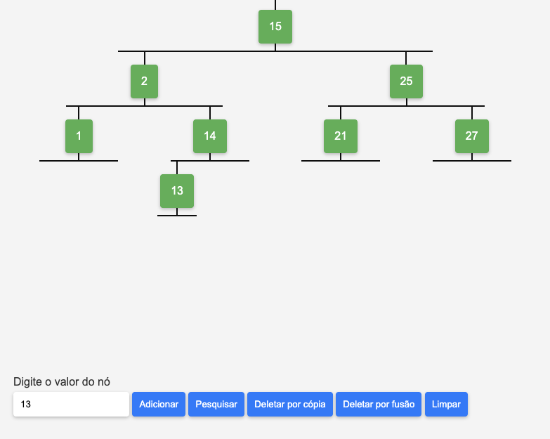

# AVL Tree with TypeScript and Deno

# Como rodar:

Abrir public/index.html no navegador

# Como compilar:

1. Instalar o Deno: https://deno.land/#installation
2. Instalar dsbuild: deno install -frAg jsr:@orgsoft/dsbuild
3. Executar o build: dsbuild --in src/index.ts --out public/app.js --watch

# Como rodar os testes:

1. Instalar o Deno: https://deno.land/#installation
2. Executar o comando na pasta do projeto: deno test
